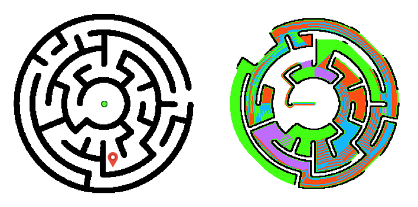

# SMA

Projet Universitaire : Conception et implémentation d'un système multi-agents durant l'unité d'enseignement "[HAI716I](https://sites.google.com/view/hai716i/home) - Programmation orientée agents" enseignée par madame [CROITORU Madalina](http://www.lirmm.fr/~croitoru/). L'ensemble des fichiers de codes est fourni dans le dossier joint avec ce document et sont exécutables avec [python](https://www.python.org/).

<p align="center">
  
</p>

# Utilisation 

Système multi-agents d'exploration aveugle de labyrinthe. Le dossier "SMA_no_memory" contient un système où les agents ne partagent pas les informations collectées pendant l'exlporation et le dossier "SMA_memory" contient un système avec des agents qui partagent leurs informations.  

```shell 
(base) C:\Users\AissAiss\SMA\SMA_memory>python main.py
```

```shell 
(base) C:\Users\AissAiss\SMA\SMA_no_memory>python main.py
```

Université Montpellier 2
Master IASD
